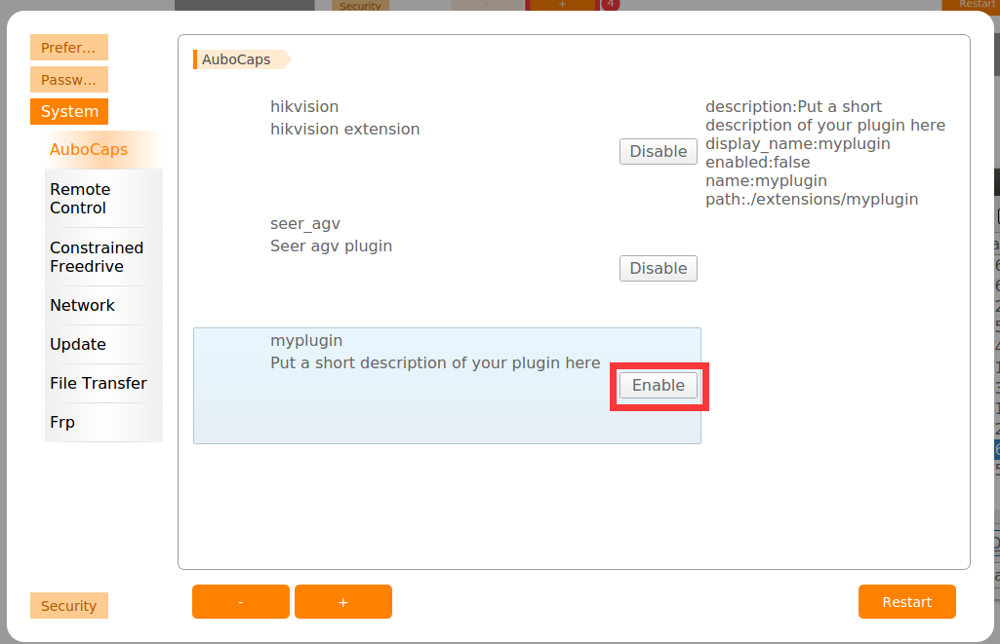

<div align="center">
  <h1 align="center">template</h1>
  <h3 align="center">
    aubo_caps Qt Creator 向导
  </h3>
</div>


## 安装

```bash
git clone http://git.aubo-robotics.cn:8001/aubo_plus/template.git
cd template
chmod +x ./INSTALL.sh
./INSTALL.sh
```

## 使用

### 1. 新建插件工程

打开 Qt Creator, 点击文件->新建文件或者工程


在弹出的向导中选择 `Library` -> `aubo_caps`


选择工程保存路径，点击下一步(Next)


输入工程详细信息: 厂商名字，Email，工程描述，官网链接，点击下一步(Next)


选择编译系统，目前仅支持CMake，点击下一步(Next)


选择编译工具链，需要选择 Qt 5.12.9 + gcc7.5工具链，单击下一步(Next)


最后一步会展示添加到工程的文件，单击完成(Finish)


### 2. 编译工程

右键工程名字，选择 CMake  

> 由于 CMake 会联网下载依赖，所以这一步要求开发设备必须联网；根据网络连接情况，CMake 过程会持续一段时间。


CMake 完成之后可以对工程进行编译了，右键工程名字，选择 Build


### 3. 向工程添加新的节点

点击菜单栏的新建 -> 文件或工程，在弹窗中选择 aubo_caps -> Aubo installation/program Node，点击选择(Choose)


输入节点名字(英文)，点击 Browse (浏览) 按钮


在 src 文件夹下新建 program/installation 文件夹, 然后点击 open (打开)


点击下一步(Next)


选择节点类型 Program/Installation，点击下一步(Next)


最后一页将展示将要添加到工程的文件列表，点击完成(Finish)


由于 Qt Creator 无法将源文件直接添加到工程中，需要手动加在`CMakeLists.txt` 中添加节点源码

上面步骤中,在 src 文件夹下已经创建完 installation 文件夹或 program文件夹,则将下面对应的语句取消注释 (删除前面的 "#")

```cmake
...
# file(GLOB_RECURSE install_src "src/installation/*")
# file(GLOB_RECURSE program_src "src/program/*")
...
```


为了使加入的节点包含到插件中，还需要在 `activator.cpp` 中添加响应语句

先将对应的服务类头文件引入

```cpp
#include "program/hello_program_node_service.h"
```


之后取消对应需要注册的节点类型的注释,修改类名


重新执行 CMake -> Build 步骤

### 4. 打包

通过生成的 `deploy.sh` 脚本打包

```bash
cd <工程根目录>
chmod +x ./deploy.sh
./deploy.sh

# 插件将生成在 build 目录
```


### 5. 加载插件到示教器

将打包生成的插件压缩包拷贝到 arcs 工作空间(`/root/arcs_ws`)


启动 aubo_scope 示教器软件，进入主页，点击 Settings -> System ->  AuboCaps，点击页面下方的 `+`


在弹窗中选择要加载的插件


加载完成之后，在 AuboCaps 界面使能加载的插件(点击Enable)



重启软件，就可以在  Program -> AuboCaps窗口看到加载的插件


至此，我们已经完成了一个插件的开发。