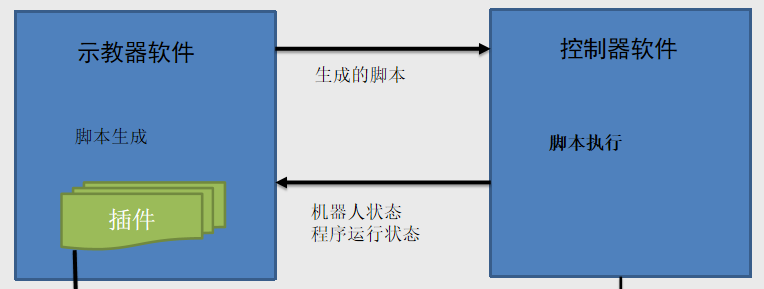
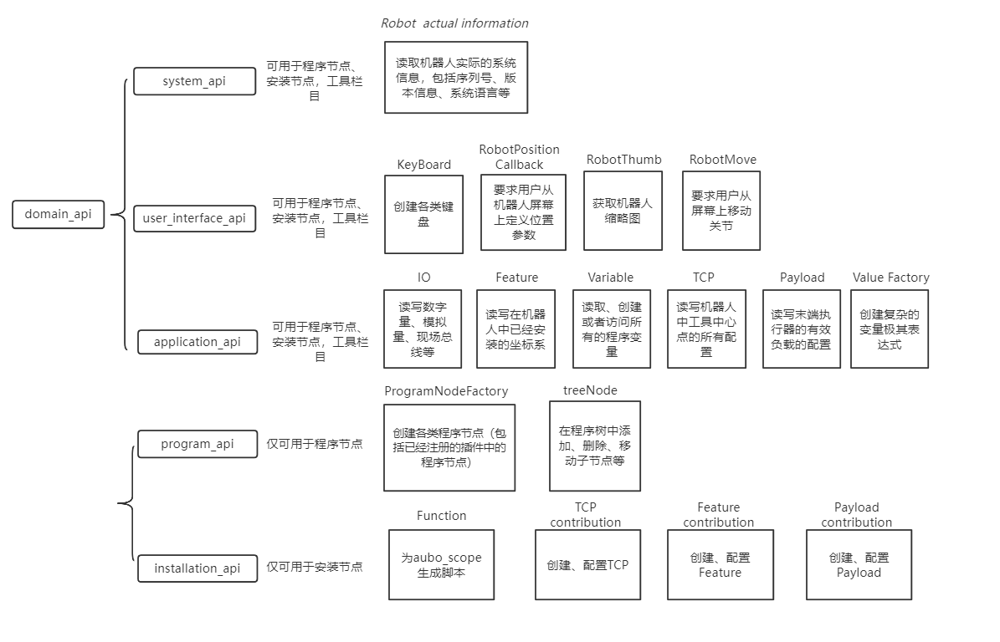

# 插件开发文档

## ARCS软件结构介绍

  

aubo_scope：示教器软件，aubo_control：控制器软件，插件是作为一个库加载到aubo_scope中随着aubo_scope的运行而运行的。  

aubo_scope、插件与aubo_control的通讯使用的是aubo_sdk，插件可以使用aubo_caps来调用aubo_scope中的接口，从而与aubo_scope进行交互。  

## 插件介绍

插件加载到aubo_scope中有两种类型，一种是程序节点类型，一种是安装节点类型，分别会加载到aubo_scope 的编程部分和配置部分，不同类型的插件节点所要实现的功能也有所不同，在使用aubo_caps时调用的接口也有所不同  

### 程序节点

程序节点是在编程时可以添加到程序树中的节点，插件的编程节点可以在机械臂运行工程时实现插件要执行的动作，比如一个夹爪插件的程序节点的功能可以是工程运行到该节点时让夹爪打开或者关闭。  

要实现上面的功能需要在程序节点的Contribution类中的generateScript函数中向工程脚本添加对应的脚本语句，比如在编写机器人工程时添加了一个夹爪插件程序节点，并在该节点中设置了关闭夹爪，那么在生成脚本函数中就可以向工程脚本添加对应功能的脚本语句。

### 安装节点

安装节点是在配置部分的节点，一般用于对插件所使用的外设进行参数配置和调试，比如夹爪插件的安装节点可以设置与夹爪连接相关的参数、测试与夹爪的连接状态、设置夹爪夹紧时力的大小、测试夹爪夹紧松开功能。安装节点中也有generateScript函数，在该函数中插入的脚本语句只会在工程脚本开始的地方执行一次，一般的功能是与外设建立通讯或者定义一些函数。

### 插件接口aubo_caps

aubo_caps是用于插件与aubo_scope进行交互的接口，分为system_api、user_interface_api、application_api、program_api和installation_api。  
  

### 特殊用法

安装节点和程序节点可以使用已经已有的函数进行数据保存，在程序节点的Contribution类和安装节点的InstallationNode类中可以通过添加 

```
#include "aubo_caps++/meta_type.h" 
...
DECLARE_ATTR（名称，类型，初始值）
```
来定义一个需要保存的数据，保存数据的类型只支持部分类型，比如基础的数据类型：int、double、string、vector<string>等等，也支持scope数据库中的数据类型，比如IOPtr、FeaturePtr等等。程序节点中的数据会保存在工程文件中，安装节点的数据会保存在配置文件中，上面两种文件都会保存在```/arcs_ws/program/```文件夹中。

定义了一个需要保存的数据后可以通过调用一下几个函数来对数据进行操作。

```
get_名称()
set_名称()
set_名称_default()
reset_名称()
```

